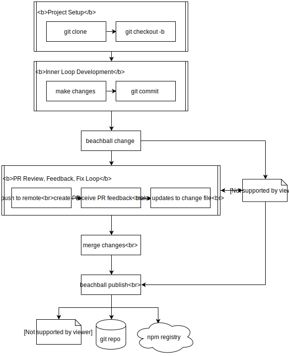

Javascript ecosystem moves fast. It moves so fast that sometimes the tools need to catch up to it. One of the reasons that this particular ecosystem is so vibrant and agile is in its ability to share code via npm packages. This has led to an explosion of versions of packages in the npm registries. These days, we have public and private registries. Developers also have to keep their git repos sync'ed up with the npm registry versions... what a hassle!

## Beachball Workflow

First off, a ~~picture~~ diagram is worth a thousand words, so here it is:

[diagram source in draw.io](./beachball.drawio)

Without any configuration, `beachball` fits into your workflow. When you have made some commits to your branch, simply fire up `beachball change` to generate change files. During PR review and feedback loops, your colleagues might remind you to modify your change file descriptions or change type. This then gets merged to the target branch (e.g. `master`). After this, `beachball publish` is either called by a continuous integration (CI) system or manually by a developer. When this is called, three things happen:

1. All change files are deleted (more than one change file can be checked in before a single publish happens)

2. Versions are bumped, checked in locally and pushed remotely

3. npm packages are published to a public or private registry

At that point, your repo is ready for the next change!
